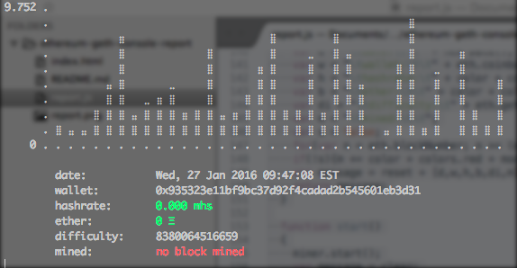

##Geth

console report tool

---

Start your **geth** console

```
geth -rpc console 2> geth.log
```

once the console is up an running, copy past the below code

```
var report = (function(){

	var graph = {rows:15,cols:36,vals:[],chars:["⠀", "⣀", "⣤", "⣶", "⣿"]};
	for(var n = 0; n < graph.cols; n++){graph.vals.push(0);};

	var colors = {black:"30",red:"31",green:"32",yellow:"33",blue:"34",magenta:"35",cyan:"36",white:"37"};
	var color = "\x1b[";
	var modifier = {normal:"m",bold:";1m",fill:";3m",underline:";4m",};

	var reset = color + "0" + modifier.normal;
	var clear = "\033c";

	var wait = 250;
	var interval = {};

	var wallet = eth.coinbase;
	var hashrate = 0;
	var date = new Date();
	function update()
	{
		!miner ? false : miner.start();
		date = new Date();
	};

	function mined(){};

	function matrix(x, y) {
	  var arr = new Array(y);
		for (var i = 0; i < y; i++){arr[i] = new Array(x);}
		return arr;
	};

	function padding(str, n) {
	  var linew = str.split('\n')[0].length;
	  var line = Array(linew).join(' ') + '\n';
	  str = Array(n).join(line) + str;
	  str = str + Array(n).join(line);
	  str = str.replace(/^/gm, Array(n).join(' '));
	  return str;
	};

	function string(out) {
	  var buf = [];
		for (var i = 0; i < out.length; i++){buf.push(out[i].join(''));}
	  return buf.join('\n');
	};

	function max(data) {
	  var n = data[0];
	  for (var i = 1; i < data.length; i++){n = data[i] > n ? data[i] : n;};
	  return n;
	};	

	function draw()
	{
		graph.vals.shift();
		graph.vals.push(hashrate);

	  var w = 80;
	  var h = 10;

	  var pad = 0;
	  w -= pad * 2;
	  h -= pad * 2;

	  var out = matrix(w, h);
	  var m = max(graph.vals) || 0;
	  var label = Math.abs(m).toString();
	  var labelw = label.length;
	  var labelp = 1;

	  var ch = h;
	  var cw = w - labelw - labelp;

	  for (var y = 0; y < h; y++) {
	    for (var x = 0; x < w; x++) {
	      out[y][x] = ' ';
	    };
	  };

	  for (var i = 0; i < labelw; i++) {out[0][i] = label[i];}
	  out[h - 1][labelw - labelp] = '0';
	  for (var y = 0; y < h; y++) {out[y][labelw + labelp] = '․';}

	  var x = labelw + labelp;
	  while (x < w) {
	    out[h - 1][x++] = '․';
	    out[h - 1][x++] = ' ';
	  }

	  var space = Math.floor(w / 2) - 1;
	  var excess = Math.max(0, graph.vals.length - space);
	  if (excess) graph.vals = graph.vals.slice(excess);

	  var x = labelw + labelp + 2;
	  for (var i = 0; i < graph.vals.length; i++) {
	    var d = graph.vals[i];
	    var p = d / m;
	    var dy = (h - 2) * p;
	    var y = Math.round(dy);
	    var c = y < 0 ? graph.chars[0] : graph.chars[4];
	    if (y < 0){y = -y};

	    dy = Math.floor(Math.abs((dy - y)*10));
	    if(dy < 0){dy = 0;}
	    var index = true;
	    while (y--) {
	      out[Math.abs(y - h) - 2][x] = dy != 0 && index ? graph.chars[dy] : c;
	      index = false;
	    }
	    x += 2;
	  }

	  return padding(string(out, h), pad);
	}

	function stats()
	{
		var d = "\tdate:\t\t" + new Date();
		var w = "\twallet:\t\t" + eth.coinbase;
		var h = "\thashrate:\t" + color + colors.green + modifier.bold + parseFloat((miner.hashrate/1000)/1000).toFixed(3) + " mhs";
		var b = "\tether:\t\t" + color + colors.green + modifier.bold + web3.fromWei(eth.getBalance(eth.coinbase), "ether") + " Ξ";
		var di = "\tdifficulty:\t" + eth.getBlock("latest").difficulty;
		var m = "\tmined:\t\t";
		var s = false;
		for(var n = eth.blockNumber; n >= (eth.blockNumber-10); n--){if(eth.getBlock(n).miner == eth.coinbase){m += " " + n;s = true;}};
		if(!s){m += color + colors.red + modifier.bold + "no block mined"};
		var message = reset + [d,w,h,b,di,m].join(" " + reset + "\n");
		return message;
	}

	function start()
	{
		miner.start();
		var message = clear;
		message += reset;
		message += color + colors.green + modifier.normal + "Starting Report\n";
		message += reset;
		message += "*please wait for initial response*";
		console.log(message);
		interval = setInterval(function(){
			hashrate = parseFloat((miner.hashrate/1000)/1000).toFixed(3);
			var s = stats();			
			var d = draw();		
			console.log("\033[2J" + "\033[0f" + reset + d + "\n\n" + reset + s + reset);
		}, wait);

	};

	function stop()
	{
		clearInterval(interval);
		var message = "";
		message += reset;
		message += color + colors.red + "Stopping Report\n";
		message += reset;
		message += "*please wait for shut down of reporting*";
		console.log(message);		
	};

	return {
		start:function(){start()},
		stop:function(){stop()}
	};

})();

```

###start the reporting

```
report.start()
```
***you'll see this***



###stop the reporting

```
report.stop()
```

---

###donations appreciated

* **eth**: 0x30bb4357cd6910c86d2238bf727cbe8156680e62
* **btc**: 1NaVpK1qjx2ZT2e4xLDiiDjHiguR7DM8j2

 
